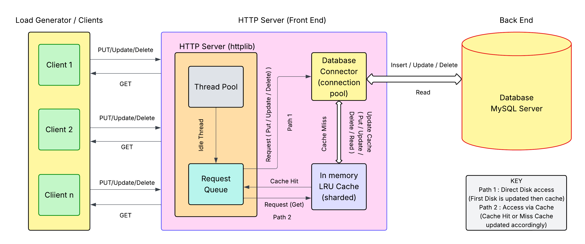

## Project Title: 
**PERFORMANCE TESTING AND BENCHMARKING OF HTTP BASED KV SERVER**

## Architecture Diagram:



## Description: 
The goal of the project is to build a multi-tier system (HTTP server with a key-value (KV) storage system ), and perform its load test across various loads to identify its capacity and bottleneck resource.

**There are three main components in this system:** 
- a multi-threaded HTTP server with a KV cache (in-memory storage), 
- a load generator/test client (client side), and 
- a database (disk storage). 

The server is built over HTTP, and uses a pool of worker threads (httplib) to accept and process requests received from the clients. The clients generate requests to get and put key-value pairs at the server. The server stores all key-value pairs in a persistent MySQL database, and also caches the most frequently used key-value pairs in an in-memory LRU cache.The load generator will emulate multiple clients, and generate client requests concurrently to the server. 

**The implementation demonstrates handling of two types of requests that follow different execution paths like one accessing memory and another going to disk.** 

This is demonstrated by:

1.	Restart the server. This clears the in-memory cache.
2.	Before adding any keys through the client, we try to get a key that we know exists in your MySQL database from a previous run.
The first get after a server restart for key should result in source:"database".
```bash
Enter command (add, get, update, delete, stats, exit, help): get
Enter key: 2
Request Latency: 40.377 ms
HTTP Status: 200
Server Response Body:
{"key":"2","value":"3","source":"database"}
```
3.	Immediately get the same key again. This second get should then be source:"cache" because the first get (the miss) would have loaded it into the cache.
```bash
Enter command (add, get, update, delete, stats, exit, help): get
Enter key: 2
Request Latency: 4.646 ms
HTTP Status: 200
Server Response Body:
{"key":"2","value":"3","source":"cache"}
```

## Functionalities of the System Components:
1. **Server**: The server supports create, read, update and delete operations using RESTful APIs svr.Get, svr.Post, svr.Delete.
- **read**: When reading a key-value pair, first checks the cache. If it exists, reads it from the cache; otherwise, fetches it from the database and inserts it into the cache, evicting an existing pair if necessary.  
- **create**: When a new key-value pair is created, it is stored both in the cache and in the database. If the cache is full, evict an existing key-value pair based on LRU. 
- **update**: When a key is updated it is simultaneously updated in the database and the cache if the key exists.
svr.Post is used here instead of separate functions for Put and Update as it handles the insert and update operations in a compact manner within the same method (query).
- **delete**: Performs all delete operations on the database. If the affected key-value pair also exists in the cache, deletes it from the cache as well to synchronize it with the database and prevent inconsistent data.
- **stats**: using a new endpoint : GET /stats svr.Get - This returns the number of cache hits and cache misses and cache hit rate.

2. **Cache**: It is an in-memory LRU cache. In the current server implementation, we are using the built-in C++ Standard Library to implement the LRU Cache.

```cpp
std::unordered_map<std::string, std::list<CacheEntry>::iterator> cache_map;
std::list<CacheEntry> cache_list;
```

3. **Database**: Connected a persistent KV store to the HTTP server, which stores data in the form of key-value pairs using MySQL to maintain the data sent by the clients using create, update, and delete operations. 
- **Read**: It checks whether a specific key is available in the database or not. If absent it throws an error.
- **Upsert**: Here we are compactly performing the update and insert step with the help of svr.Post API.
```sql
INSERT INTO key_value (key_name, value) VALUES (?, ?) ON DUPLICATE KEY UPDATE value = ?
```
So basically it inserts a new key, value pair or else on duplicate key it updates the value.
- **Delete**: It deletes the dey if it exists or else throws an error. 
The database connection is done using the following method:
```sql
sql::Connection* DatabaseManager::getDbConnection()
```
4. **Concurrency and thread safety**: std::mutex for Cache: All access to the shared in-memory LRU cache is protected by a std::mutex (mtx). This ensures that multiple server threads accessing or modifying the cache concurrently do so safely, preventing race conditions and data corruption.
Threadpool is implemented internally in httplib library. Number of threads are by default max(8, thread.harware_concurrency()- 1). Threads check if any request is available. Any idle thread will pick up and process that request. By default queue size is infinite.

5. **Test Client / Load Generator**: The test client connects to the server and implements the all the above functionalities. It also prints the cache statistics like the hits, misses, hit rate etc.

## Tech Stack: 
- Server is implemented in cpp. 
- Test Client is implemented in cpp.
- For server operations, httplib library is used. 
- Database (persistent storage): mysql server.
- Database connection libmysqlcppconn-dev is used.

## GitHub Repository Link: 
https://github.com/AvirupChakraborty-2212/DECS_Project_KV_Server

## Directory Structure:

    |-images
        |-architecture.jpeg
    |- include
        |- spdlog/
        |- cache.h
        |- constants.h
        |- database.h
        |- httplib.h
        |- json.hpp
        |- logger.h
    |- src
        |- cache.cpp
        |- database.cpp
        |- logger.cpp
        |- main.cpp
    |- test_client
        |- test_client.cpp
    |- CMakeLists.txt
    |- init_database.sql
    |- README.md

**Note:** constants.h contains all the configurable parameters like the network configuration, cache capacity etc.

## Steps to setup and run the project(linux):


1. Install g++ and other essential libraries:

    ```bash
    sudo apt update
    sudo apt install build-essential
    sudo apt install -y wget curl git unzip cmake jq
    sudo apt install libmysqlcppconn-dev libcurl4-openssl-dev 
    ```

2. Install mysql-server:

    ```bash    
    sudo apt install mysql-server
    ```

3. Clone this github repository:

    ```bash
    git clone https://github.com/AvirupChakraborty-2212/DECS_Project_KV_Server.git
    ```

4. Setup mysql-server:

    ```bash    
    cd DECS_Project_KV_Server
    sudo mysql < create_db.sql -p
    sudo systemctl enable --now mysql
    ```

5. Build and Compile:

    ```bash
    mkdir build 
    cd build
    cmake ..
    make
    ```
    This will create the CMake files and the executables named `kv_server` and `test_client` in the `build/` directory.

6. Pin the database using taskset:

    ```bash
    sudo taskset -cp 2,3 $(pidof mysqld)
    ```
    You should see something like this 
    
    ```bash
    pid 394's current affinity list: 0-7
    pid 394's new affinity list: 2,3
    ```

7. Open new terminal window and navigate to the build directory and pin the server to some cores using taskset command:

    ```bash
    cd build
    taskset -c 0,1 ./kv_server
    ```
    You should see something like this in the terminal once the server is up and running:

    ```bash
    Server listening on port 8080...
    ```

8. Open one more terminal and change current working directory to build/:

    ```bash
    cd build
    taskset -c 4-5 ./test_client
    ```

9. Verify taskset using the following example for the processes:
    ```bash
    taskset -c 0 ./kv_server
    pgrep kv_server
    taskset -p <PID_of_kv_server>
    ```

10. **Logging:** Once the server and client are up and running the logs will get generated in the ../logs path of the root directory.

## Sample output of the client:
```bash
(base)$ taskset -c 4-5 ./test_client
Interactive KV Client
Server target: 127.0.0.1:8080
Type 'help' for commands.

Enter command (add, get, update, delete, stats, exit, help): add
Enter key: 1
Enter value: apple
Request Latency: 155.519 ms
HTTP Status: 200
Server Response Body:
{"status":"success"}

Enter command (add, get, update, delete, stats, exit, help): get 
Enter key: 1
Request Latency: 0.982 ms
HTTP Status: 200
Server Response Body:
{"key":"1","value":"apple","source":"cache"}

Enter command (add, get, update, delete, stats, exit, help): update
Enter key: 1
Enter value: pineapple
Request Latency: 48.234 ms
HTTP Status: 200
Server Response Body:
{"status":"success"}

Enter command (add, get, update, delete, stats, exit, help): get
Enter key: 1
Request Latency: 1.028 ms
HTTP Status: 200
Server Response Body:
{"key":"1","value":"pineapple","source":"cache"}

Enter command (add, get, update, delete, stats, exit, help): delete
Enter key to delete: 1
Request Latency: 49.487 ms
HTTP Status: 200
Server Response Body:
{"status":"success"}

Enter command (add, get, update, delete, stats, exit, help): get
Enter key: 1
Request Latency: 40.677 ms
HTTP Status: 404
Server Response Body:
{"error":"key not found"}

Enter command (add, get, update, delete, stats, exit, help): stats
Request Latency: 0.976 ms
HTTP Status: 200
Server Response Body:
{"cache_hits":2,"cache_misses":1,"total_get_requests":3,"cache_hit_rate":"66.67%"}

Enter command (add, get, update, delete, stats, exit, help): help

Available commands:
  add      - Add a new key-value pair.
  get      - Retrieve the value for a given key.
  update   - Update the value for an existing key.
  delete   - Remove a key-value pair.
  stats    - Get server cache statistics.
  exit     - Close the client.


Enter command (add, get, update, delete, stats, exit, help): exit
Exiting client.
```